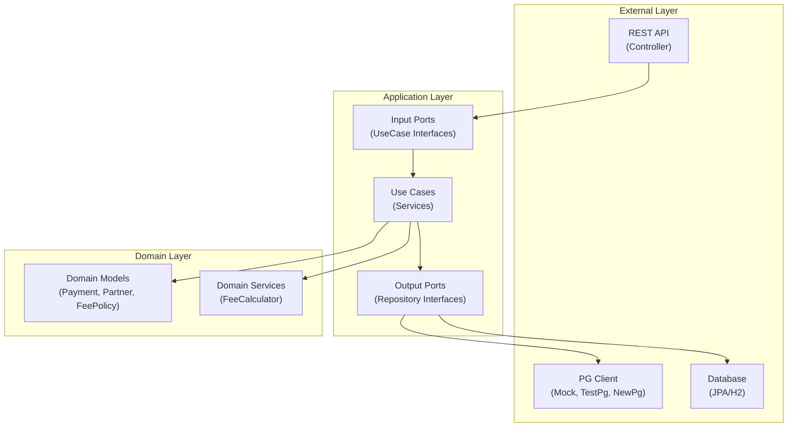
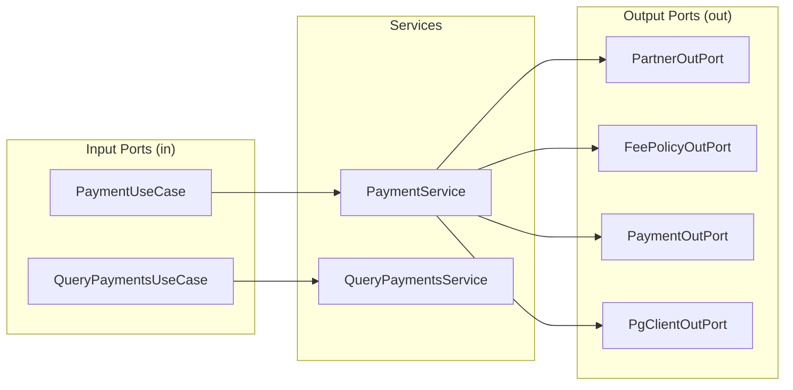
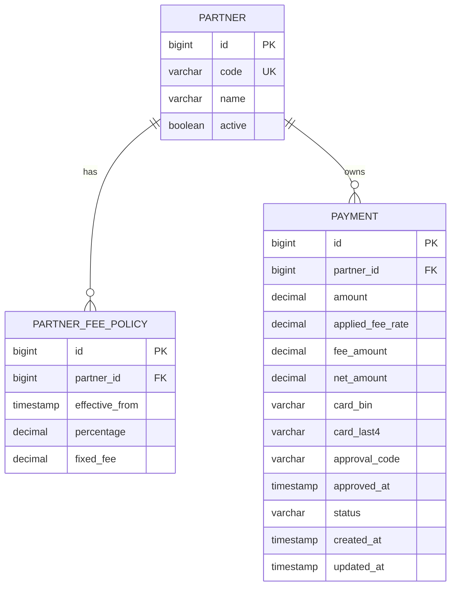

# 결제 도메인 서버 아키텍처

> 나노바나나 페이먼츠 결제 도메인 서버의 기술 아키텍처 문서

## 1. 아키텍처 개요

본 프로젝트는 **헥사고널 아키텍처**(Hexagonal Architecture / Ports and Adapters)를 기반으로 설계되었습니다.



### 핵심 원칙

| 원칙              | 설명                                        |
| ----------------- | ------------------------------------------- |
| **의존성 역전**   | 외부 계층이 내부로 의존, 내부는 외부를 모름 |
| **포트-어댑터**   | 인터페이스(포트)를 통해 외부와 통신         |
| **도메인 순수성** | `domain` 모듈은 프레임워크 의존 금지        |

---

## 2. 모듈 구조

```
backend-test-v2/
├── modules/
│   ├── domain/                    # 🔷 순수 도메인 (프레임워크 의존 X)
│   ├── application/               # 🔶 유스케이스 + 포트
│   ├── infrastructure/
│   │   └── persistence/           # 🔵 JPA 어댑터
│   ├── external/
│   │   └── pg-client/             # 🟣 PG 연동 어댑터
│   ├── common/                    # 🟤 공통 유틸
│   └── bootstrap/
│       └── api-payment-gateway/   # 🟢 Spring Boot API
└── sql/
    └── scheme.sql                 # DB 스키마 정의
```

---

## 3. 모듈별 상세

### 3.1 Domain Layer (`modules/domain`)

순수 Kotlin으로 작성된 도메인 모델. **프레임워크 의존 금지**.

```
domain/
└── src/main/kotlin/im/bigs/pg/domain/
    ├── calculation/
    │   └── FeeCalculator.kt       # 수수료 계산 유틸 (HALF_UP 반올림)
    ├── exception/
    │   └── PaymentExceptions.kt   # 도메인 예외 정의
    ├── partner/
    │   ├── Partner.kt             # 제휴사 도메인 모델
    │   └── FeePolicy.kt           # 수수료 정책 모델
    └── payment/
        └── Payment.kt             # 결제 도메인 모델 + PaymentStatus, PaymentSummary
```

#### 주요 도메인 모델

| 모델            | 설명                                                       |
| --------------- | ---------------------------------------------------------- |
| `Payment`       | 결제 이력 스냅샷 (금액, 수수료, 정산금, 상태 등)           |
| `Partner`       | 제휴사 정보 (id, code, name, active)                       |
| `FeePolicy`     | 제휴사별 수수료 정책 (percentage, fixedFee, effectiveFrom) |
| `FeeCalculator` | 수수료 계산 로직 (비율 + 고정 수수료, HALF_UP)             |

---

### 3.2 Application Layer (`modules/application`)

유스케이스 구현 및 포트(인터페이스) 정의.

```
application/
└── src/main/kotlin/im/bigs/pg/application/
    ├── partner/port/out/
    │   ├── PartnerOutPort.kt          # Partner 조회 포트
    │   └── FeePolicyOutPort.kt        # 수수료 정책 조회 포트
    ├── payment/
    │   ├── port/in/
    │   │   ├── PaymentUseCase.kt      # 결제 생성 유스케이스
    │   │   ├── PaymentCommand.kt      # 결제 커맨드
    │   │   ├── QueryPaymentsUseCase.kt # 결제 조회 유스케이스
    │   │   ├── QueryFilter.kt         # 조회 필터
    │   │   └── QueryResult.kt         # 조회 결과
    │   ├── port/out/
    │   │   ├── PaymentOutPort.kt      # 결제 저장/조회 포트
    │   │   ├── PaymentPage.kt         # 페이징 결과
    │   │   ├── PaymentQuery.kt        # 조회 쿼리
    │   │   └── PaymentSummaryProjection.kt
    │   └── service/
    │       ├── PaymentService.kt      # 결제 생성 (수수료 정책 적용)
    │       └── QueryPaymentsService.kt # 결제 조회 (커서 페이징 + summary)
    └── pg/port/out/
        ├── PgClientOutPort.kt         # PG 연동 포트
        ├── PgApproveRequest.kt        # 승인 요청 (pgCardData 포함)
        ├── PgApproveResult.kt         # 승인 결과 (cardBin, cardLast4 포함)
        └── PgCardDataDto.kt           # PG별 카드 데이터 DTO (sealed interface)
```

#### 포트 패턴



---

### 3.3 Infrastructure Layer (`modules/infrastructure/persistence`)

JPA 기반 영속성 어댑터.

```
persistence/
└── src/main/kotlin/im/bigs/pg/infra/persistence/
    ├── config/
    │   └── JpaConfig.kt               # JPA 설정
    ├── partner/
    │   ├── adapter/
    │   │   ├── PartnerPersistenceAdapter.kt
    │   │   └── FeePolicyPersistenceAdapter.kt
    │   ├── entity/
    │   │   ├── PartnerEntity.kt
    │   │   └── FeePolicyEntity.kt
    │   └── repository/
    │       ├── PartnerJpaRepository.kt
    │       └── FeePolicyJpaRepository.kt
    └── payment/
        ├── adapter/
        │   └── PaymentPersistenceAdapter.kt  # pageBy, summary 구현됨
        ├── entity/
        │   └── PaymentEntity.kt
        └── repository/
            └── PaymentJpaRepository.kt
```

---

### 3.4 External Layer (`modules/external/pg-client`)

외부 PG 연동 어댑터.

```
pg-client/
└── src/main/kotlin/im/bigs/pg/external/pg/
    ├── MockPgClient.kt            # MockPG (partnerId=1)
    ├── TestPgClient.kt            # TestPG API 연동 (partnerId=2)
    ├── NewPgClient.kt             # NewPG 토큰 기반 (partnerId=3)
    ├── config/
    │   └── TestPgProperties.kt    # TestPg 설정 (baseUrl, apiKey, iv)
    ├── crypto/
    │   └── AesGcmCrypto.kt        # AES-256-GCM 암호화
    ├── dto/
    │   └── TestPgDto.kt           # TestPg 요청/응답 DTO
    └── exception/
        └── PgExceptions.kt        # PG 예외 (Rejected, Auth, Server)
```

#### PG 클라이언트 전략

| PG Client      | partnerId | 카드 데이터 타입 | 설명                               |
| -------------- | --------- | ---------------- | ---------------------------------- |
| `MockPgClient` | 1         | `MockPgCardData` | 항상 성공, cardBin/cardLast4 반환  |
| `TestPgClient` | 2         | `TestPgCardData` | TestPg API 연동, 카드번호에서 추출 |
| `NewPgClient`  | 3         | `NewPgCardData`  | 토큰 기반, cardBin/cardLast4 없음  |

> **참고**: PG별 카드 데이터 다형성 설계는 [PG_CARD_DATA_POLYMORPHISM.md](./payment/PG_CARD_DATA_POLYMORPHISM.md) 참조

---

### 3.5 Bootstrap Layer (`modules/bootstrap/api-payment-gateway`)

Spring Boot 애플리케이션 진입점.

```
api-payment-gateway/
└── src/main/kotlin/im/bigs/pg/api/
    ├── PgApiApplication.kt            # 메인 애플리케이션
    ├── config/
    │   ├── DataInitializer.kt         # 시드 데이터 (Partner 3개 + FeePolicy)
    │   ├── GlobalExceptionHandler.kt  # 전역 예외 처리기
    │   ├── HttpClientConfig.kt        # RestTemplate 설정
    │   └── SwaggerConfig.kt           # Swagger 동적 예제 생성 (OpenApiCustomizer)
    └── payment/
        ├── PaymentController.kt       # REST Controller
        ├── PaymentControllerDocs.kt   # Swagger 문서 인터페이스
        └── dto/
            ├── CreatePaymentRequest.kt   # 결제 요청 DTO
            ├── PaymentResponse.kt        # 결제 응답 DTO
            ├── PgCardData.kt             # PG별 카드 데이터 (sealed interface)
            └── QueryDtos.kt              # 조회 요청/응답 DTO
```

---

## 4. 데이터베이스 스키마



### 시드 데이터

| Partner ID | Code     | Name              | 수수료율 | 고정 수수료 | PG Client      |
| ---------- | -------- | ----------------- | -------- | ----------- | -------------- |
| 1          | MOCK1    | Mock Partner 1    | 2.35%    | 0원         | `MockPgClient` |
| 2          | TESTPAY1 | TestPay Partner 1 | 3.00%    | 100원       | `TestPgClient` |
| 3          | NEWPG1   | NewPG Partner 1   | 2.50%    | 50원        | `NewPgClient`  |

---

## 5. 관련 문서

| 문서                                                                           | 설명                         |
| ------------------------------------------------------------------------------ | ---------------------------- |
| [payment/](./payment/)                                                         | 결제 도메인 문서 폴더        |
| [payment/PAYMENT_FLOW.md](./payment/PAYMENT_FLOW.md)                           | 결제 처리 흐름 상세          |
| [payment/PG_CARD_DATA_POLYMORPHISM.md](./payment/PG_CARD_DATA_POLYMORPHISM.md) | PG별 카드 데이터 다형성 설계 |
| [payment/ADDING_NEW_PG.md](./payment/ADDING_NEW_PG.md)                         | 새로운 PG 추가 가이드        |
| [payment/SWAGGER_DYNAMIC_EXAMPLES.md](./payment/SWAGGER_DYNAMIC_EXAMPLES.md)   | Swagger 동적 예제 생성       |
