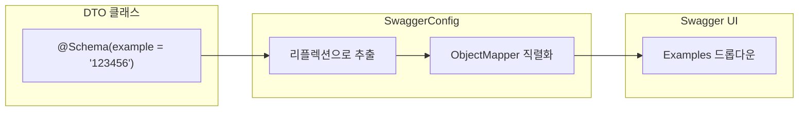
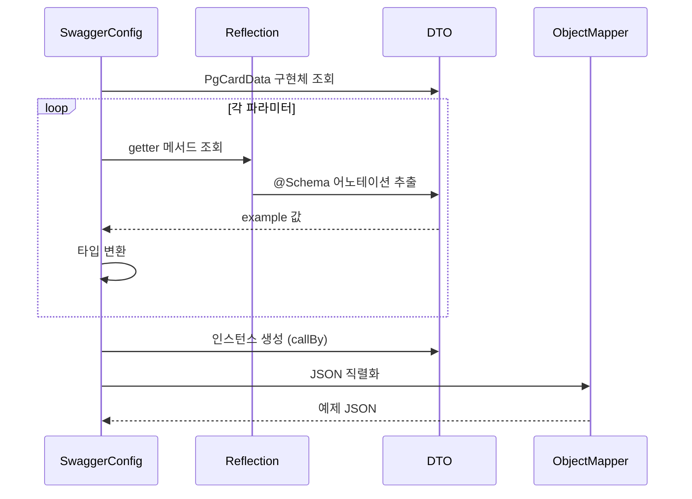

# Swagger 동적 예제 생성

## 개요

`SwaggerConfig`는 Swagger UI에 표시되는 API 예제를 하드코딩 대신 DTO의 `@Schema(example)` 어노테이션을 기반으로 동적 생성합니다.



## 동작 방식

### 1. OpenApiCustomizer

`OpenApiCustomizer`를 사용하여 OpenAPI 스펙을 후처리합니다:

```kotlin
@Bean
fun createPaymentExamplesCustomizer(): OpenApiCustomizer = OpenApiCustomizer { openApi ->
    val examples = buildPaymentExamples()
    openApi.paths
        ?.get("/api/v1/payments")
        ?.post
        ?.requestBody
        ?.content
        ?.get("application/json")
        ?.let { mediaType ->
            examples.forEach { (name, example) -> mediaType.addExamples(name, example) }
        }
}
```

### 2. 예제 생성 흐름



### 3. 값 결정 우선순위

| 조건                             | 결과               |
| -------------------------------- | ------------------ |
| `@Schema(example)` 있음          | example 값 사용    |
| example 없음 + optional 파라미터 | Kotlin 기본값 사용 |
| example 없음 + required 파라미터 | 타입별 기본값 사용 |

### 4. 타입별 기본값

| 타입         | 기본값            |
| ------------ | ----------------- |
| `String`     | `""`              |
| `Int`        | `0`               |
| `Long`       | `0L`              |
| `Double`     | `0.0`             |
| `Float`      | `0.0f`            |
| `Boolean`    | `false`           |
| `BigDecimal` | `BigDecimal.ZERO` |
| `List`       | `emptyList()`     |
| `Set`        | `emptySet()`      |
| `Map`        | `emptyMap()`      |
| `Array`      | `emptyArray()`    |

## 예제 추가 방법

새로운 PG를 추가하려면:

1. `PgCardData` 구현체 생성 (`@Schema(example)` 포함)
2. `SwaggerConfig.buildPaymentExamples()`에 Triple 추가

```kotlin
// 1. DTO 정의
data class FooPgCardData(
    @get:Schema(example = "FOO") val type: String = "FOO",
    @get:Schema(example = "value1") val field1: String,
    @get:Schema(example = "123") val field2: Int,
) : PgCardData

// 2. SwaggerConfig 수정
private fun buildPaymentExamples() = listOf(
    Triple("MOCK", MockPgCardData::class, 1L),
    Triple("TEST_PG", TestPgCardData::class, 2L),
    Triple("NEW_PG", NewPgCardData::class, 3L),
    Triple("FOO", FooPgCardData::class, 4L),  // 추가
)
```

## 확인 방법

```bash
./gradlew :modules:bootstrap:api-payment-gateway:bootRun
```

1. 브라우저에서 http://localhost:8080/swagger-ui.html 접속
2. **Payment** → **POST /api/v1/payments** 선택
3. **Request body** 섹션 → **Examples** 드롭다운 확인
4. MOCK, TEST_PG, NEW_PG 예제 선택 가능

## 관련 파일

| 파일                                                                                                                                                                 | 설명                 |
| -------------------------------------------------------------------------------------------------------------------------------------------------------------------- | -------------------- |
| [SwaggerConfig.kt](file:///Users/yk/backend-test-v2/modules/bootstrap/api-payment-gateway/src/main/kotlin/im/bigs/pg/api/config/SwaggerConfig.kt)                    | 동적 예제 생성 로직  |
| [PgCardData.kt](file:///Users/yk/backend-test-v2/modules/bootstrap/api-payment-gateway/src/main/kotlin/im/bigs/pg/api/payment/dto/PgCardData.kt)                     | PG별 카드 데이터 DTO |
| [CreatePaymentRequest.kt](file:///Users/yk/backend-test-v2/modules/bootstrap/api-payment-gateway/src/main/kotlin/im/bigs/pg/api/payment/dto/CreatePaymentRequest.kt) | 결제 생성 요청 DTO   |
