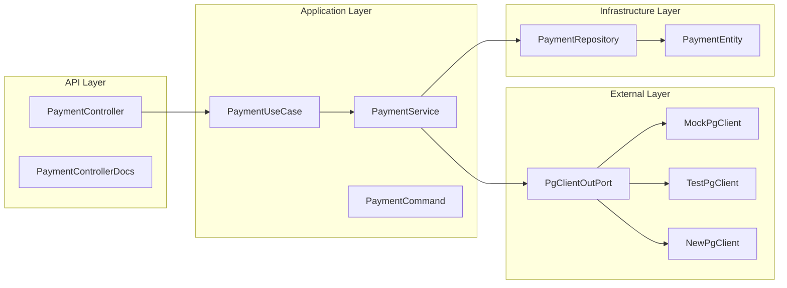
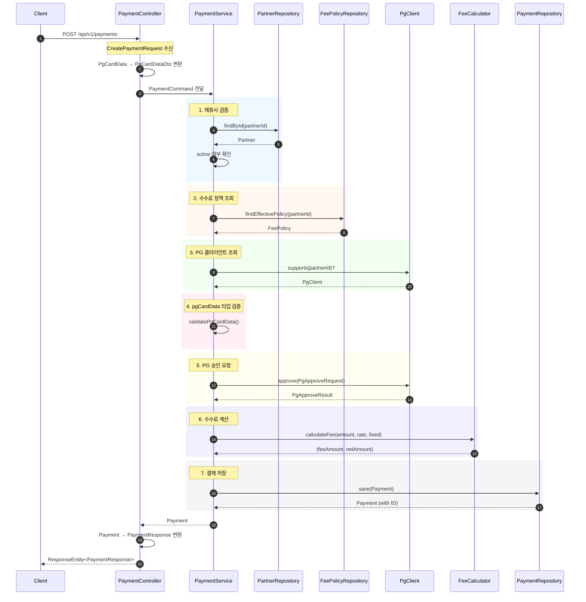
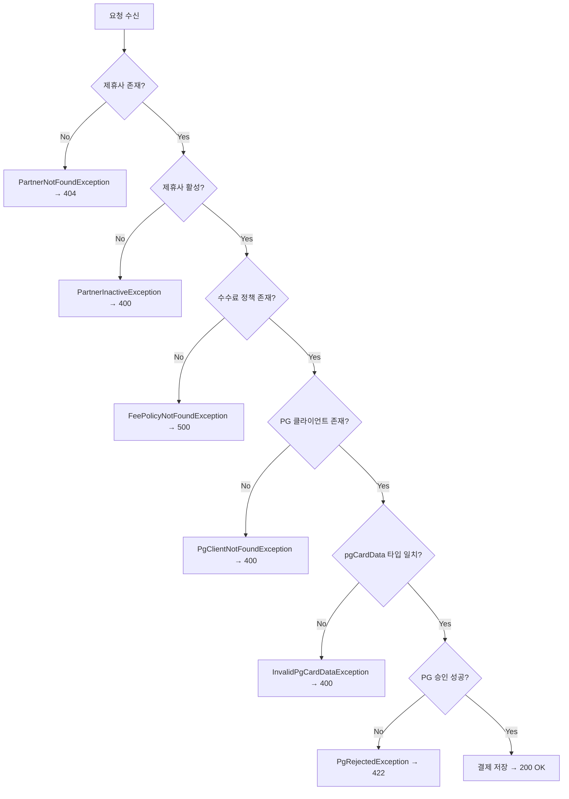

# 결제 생성 API 처리 흐름

결제 생성 요청이 컨트롤러에서 시작하여 데이터베이스에 저장되고 응답이 반환되기까지의 전체 흐름을 설명합니다.

## 아키텍처 개요



## 상세 처리 흐름



## 단계별 상세 설명

### 1단계: 요청 수신 (PaymentController)

```kotlin
// PaymentController.kt
@PostMapping
override fun create(@RequestBody req: CreatePaymentRequest): ResponseEntity<PaymentResponse> {
    val pgCardDataDto = when (val data = req.pgCardData) {
        is MockPgCardData -> MockPgCardDataDto(data.cardBin, data.cardLast4, data.productName)
        is TestPgCardData -> TestPgCardDataDto(data.cardNumber, data.birthDate, data.expiry, data.cardPassword)
        is NewPgCardData -> NewPgCardDataDto(data.encryptedCardToken, data.merchantId, data.orderId)
    }

    val saved = paymentUseCase.pay(PaymentCommand(req.partnerId, req.amount, pgCardDataDto))
    return ResponseEntity.ok(PaymentResponse.from(saved))
}
```

**주요 처리:**

- `CreatePaymentRequest` JSON 역직렬화
- `PgCardData` (API DTO) → `PgCardDataDto` (Application DTO) 변환
- `PaymentCommand` 생성

### 2단계: 제휴사 검증 (PaymentService)

```kotlin
val partner = partnerRepository.findById(command.partnerId)
    ?: throw PartnerNotFoundException(command.partnerId)

if (!partner.active) {
    throw PartnerInactiveException(partner.id)
}
```

| 조건          | 예외                       | HTTP Status |
| ------------- | -------------------------- | ----------- |
| 제휴사 없음   | `PartnerNotFoundException` | 404         |
| 비활성 제휴사 | `PartnerInactiveException` | 400         |

### 3단계: 수수료 정책 조회

```kotlin
val policy = feePolicyRepository.findEffectivePolicy(partner.id)
    ?: throw FeePolicyNotFoundException(partner.id)
```

현재 시점에 유효한(effectiveAt ≤ now) 정책 중 가장 최신 정책을 조회합니다.

### 4단계: PG 클라이언트 조회

```kotlin
val pgClient = pgClients.firstOrNull { it.supports(partner.id) }
    ?: throw PgClientNotFoundException(partner.id)
```

| partnerId | PG Client    |
| --------- | ------------ |
| 1         | MockPgClient |
| 2         | TestPgClient |
| 3         | NewPgClient  |

### 5단계: pgCardData 타입 검증

```kotlin
private fun validatePgCardData(partnerId: Long, command: PaymentCommand) {
    val (expectedType, isValid) = when (partnerId) {
        1L -> "MockPgCardData" to (command.pgCardData is MockPgCardDataDto)
        2L -> "TestPgCardData" to (command.pgCardData is TestPgCardDataDto)
        3L -> "NewPgCardData" to (command.pgCardData is NewPgCardDataDto)
        else -> return
    }

    if (!isValid) throw InvalidPgCardDataException(partnerId, expectedType, actualType)
}
```

### 6단계: PG 승인 요청

```kotlin
val approve = pgClient.approve(PgApproveRequest(
    partnerId = partner.id,
    amount = command.amount,
    pgCardData = command.pgCardData,
))
```

**TestPgClient 예시:**

1. `TestPgCardDataDto`에서 카드 정보 추출
2. `TestPgPayload` 생성
3. AES-256-GCM 암호화
4. TestPG API 호출
5. `PgApproveResult` 반환

### 6단계: 수수료 계산

```kotlin
val (fee, net) = FeeCalculator.calculateFee(
    command.amount,
    policy.percentage,
    policy.fixedFee,
)
```

**계산 공식:**

```
feeAmount = amount × (percentage / 100) + fixedFee
netAmount = amount - feeAmount
```

### 7단계: 결제 저장

```kotlin
val payment = Payment(
    partnerId = partner.id,
    amount = command.amount,
    appliedFeeRate = policy.percentage,
    feeAmount = fee,
    netAmount = net,
    cardBin = approve.cardBin,       // PG 응답에서 가져옴
    cardLast4 = approve.cardLast4,   // PG 응답에서 가져옴
    approvalCode = approve.approvalCode,
    approvedAt = approve.approvedAt,
    status = PaymentStatus.APPROVED,
)

return paymentRepository.save(payment)
```

### 8단계: 응답 반환

```kotlin
// PaymentResponse.kt
data class PaymentResponse(
    val id: Long,
    val partnerId: Long,
    val amount: BigDecimal,
    val feeAmount: BigDecimal,
    val netAmount: BigDecimal,
    val appliedFeeRate: BigDecimal,
    val approvalCode: String?,
    val approvedAt: Instant?,
    val status: String,
    val createdAt: Instant,
)
```

## 에러 처리 흐름



## 관련 파일

| 레이어      | 파일                                                                                                                                                                 | 역할             |
| ----------- | -------------------------------------------------------------------------------------------------------------------------------------------------------------------- | ---------------- |
| API         | [PaymentController.kt](file:///Users/yk/backend-test-v2/modules/bootstrap/api-payment-gateway/src/main/kotlin/im/bigs/pg/api/payment/PaymentController.kt)           | HTTP 요청 처리   |
| API         | [CreatePaymentRequest.kt](file:///Users/yk/backend-test-v2/modules/bootstrap/api-payment-gateway/src/main/kotlin/im/bigs/pg/api/payment/dto/CreatePaymentRequest.kt) | 요청 DTO         |
| API         | [PaymentResponse.kt](file:///Users/yk/backend-test-v2/modules/bootstrap/api-payment-gateway/src/main/kotlin/im/bigs/pg/api/payment/dto/PaymentResponse.kt)           | 응답 DTO         |
| Application | [PaymentService.kt](file:///Users/yk/backend-test-v2/modules/application/src/main/kotlin/im/bigs/pg/application/payment/service/PaymentService.kt)                   | 비즈니스 로직    |
| Application | [PaymentCommand.kt](file:///Users/yk/backend-test-v2/modules/application/src/main/kotlin/im/bigs/pg/application/payment/port/in/PaymentCommand.kt)                   | 입력 포트        |
| External    | [TestPgClient.kt](file:///Users/yk/backend-test-v2/modules/external/pg-client/src/main/kotlin/im/bigs/pg/external/pg/TestPgClient.kt)                                | TestPG 연동      |
| Domain      | [FeeCalculator.kt](file:///Users/yk/backend-test-v2/modules/domain/src/main/kotlin/im/bigs/pg/domain/calculation/FeeCalculator.kt)                                   | 수수료 계산      |
| Exception   | [GlobalExceptionHandler.kt](file:///Users/yk/backend-test-v2/modules/bootstrap/api-payment-gateway/src/main/kotlin/im/bigs/pg/api/config/GlobalExceptionHandler.kt)  | 예외 → HTTP 응답 |
