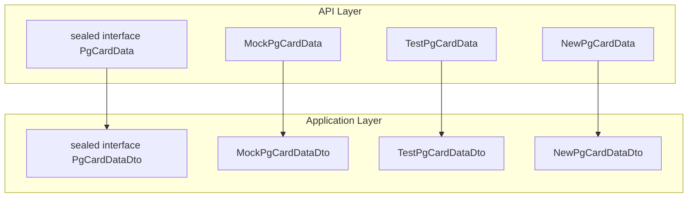
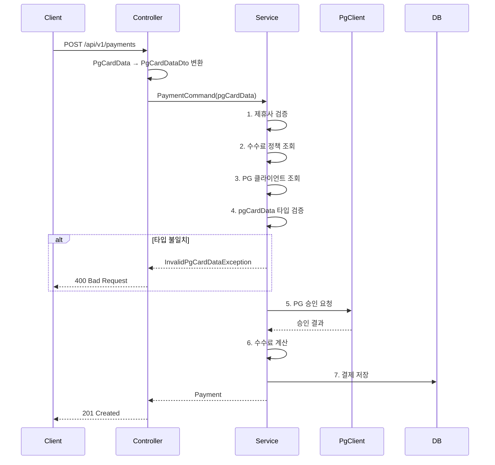

# PG 카드 데이터 다형성 설계

## 개요

결제 생성 API에서 각 PG사별로 상이한 카드 정보를 처리하기 위해 **다형성 기반 설계**를 적용했습니다.



## PG별 라우팅

| partnerId | PG     | type      | 필수 필드                                   |
| --------- | ------ | --------- | ------------------------------------------- |
| 1         | MockPG | `MOCK`    | cardBin, cardLast4, productName             |
| 2         | TestPG | `TEST_PG` | cardNumber, birthDate, expiry, cardPassword |
| 3         | NewPG  | `NEW_PG`  | encryptedCardToken, merchantId, orderId     |

## 결제 처리 흐름



## 요청 예시

### MockPG (partnerId=1)

```json
{
  "partnerId": 1,
  "amount": 1000,
  "pgCardData": {
    "type": "MOCK",
    "cardBin": "123456",
    "cardLast4": "4242",
    "productName": "테스트 상품"
  }
}
```

### TestPG (partnerId=2)

```json
{
  "partnerId": 2,
  "amount": 1000,
  "pgCardData": {
    "type": "TEST_PG",
    "cardNumber": "1111-1111-1111-1111",
    "birthDate": "19900101",
    "expiry": "1227",
    "cardPassword": "12"
  }
}
```

### NewPG (partnerId=3)

```json
{
  "partnerId": 3,
  "amount": 1000,
  "pgCardData": {
    "type": "NEW_PG",
    "encryptedCardToken": "enc_token_xxx",
    "merchantId": "M001",
    "orderId": "ORD-001"
  }
}
```

## Validation 및 에러 처리

### pgCardData 타입 검증

`PaymentService.validatePgCardData()`에서 partnerId와 pgCardData 타입 일치 여부를 검증합니다.

```kotlin
1L -> MockPgCardData 필수
2L -> TestPgCardData 필수
3L -> NewPgCardData 필수
```

### 에러 응답

| 예외                       | HTTP Status | errorCode            |
| -------------------------- | ----------- | -------------------- |
| PartnerNotFoundException   | 404         | PARTNER_NOT_FOUND    |
| PartnerInactiveException   | 400         | PARTNER_INACTIVE     |
| InvalidPgCardDataException | 400         | INVALID_PG_CARD_DATA |
| FeePolicyNotFoundException | 500         | FEE_POLICY_NOT_FOUND |
| PgClientNotFoundException  | 400         | PG_CLIENT_NOT_FOUND  |

## 민감정보 처리

- `TestPgCardData.toString()` 오버라이드: 로깅 시 `TestPgCardData(****)` 출력
- DB 저장: `cardBin`, `cardLast4`만 저장 (카드번호 전체 저장 금지)
  - MockPG: pgCardData에서 직접 추출
  - TestPG: cardNumber에서 앞 6자리/뒤 4자리 추출
  - NewPG: 토큰 기반이므로 null
- 카드번호, 비밀번호 등 민감정보는 저장/로깅 금지
